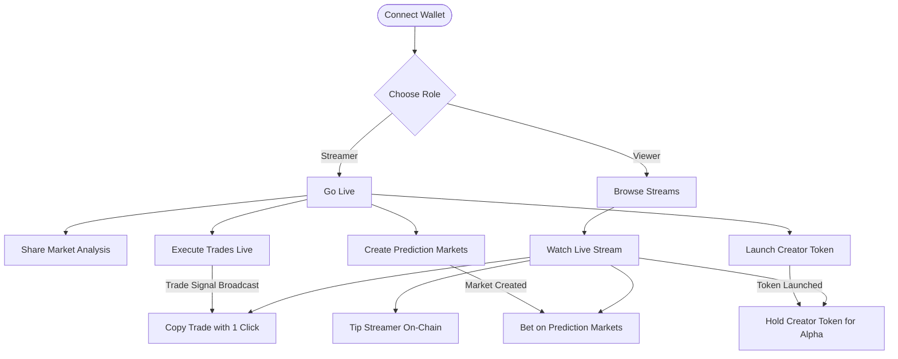
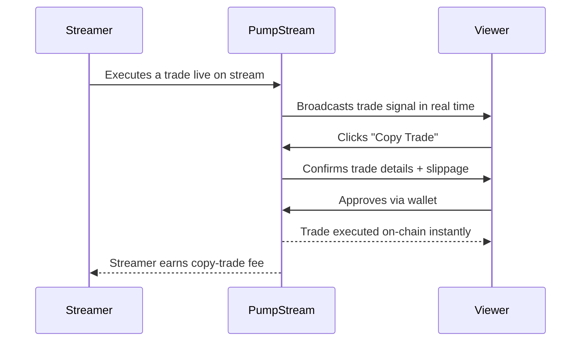
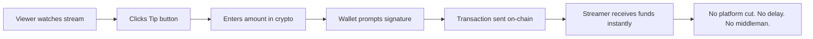
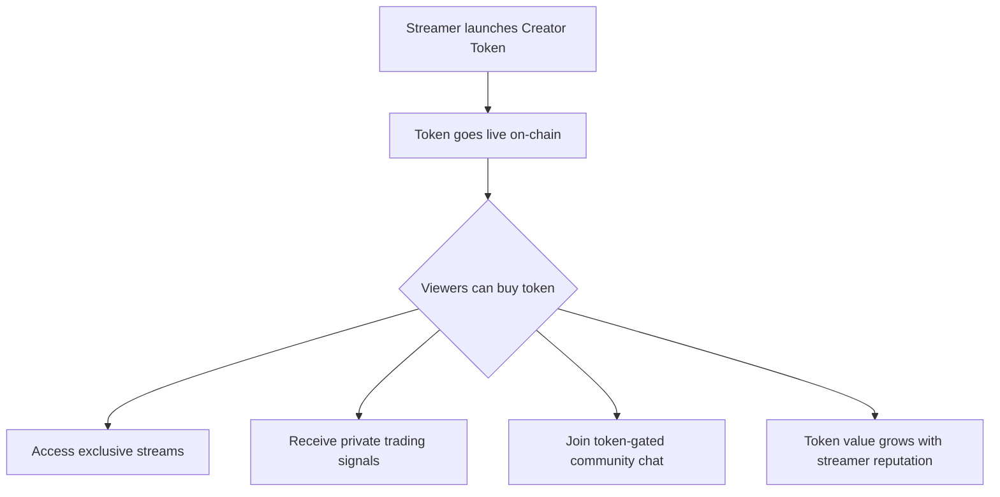
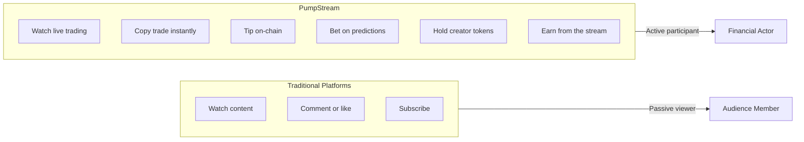

# PUMP⚡STREAM

> **The home of live crypto markets.** Stream. Trade. Earn. On-Chain.

---

## What is PumpStream?

PumpStream is a **crypto-native livestreaming platform** where traders and analysts broadcast market insights in real time while the audience interacts directly on-chain.

The crypto space has always lacked a dedicated home. Traders juggle Twitter for alpha, Discord for community, TradingView for charts, and separate DEXs to actually execute. PumpStream collapses all of that into one live, financial, on-chain experience.

---

## The Problem with Existing Platforms

| Platform | What's Missing |
|---|---|
| **Twitch / YouTube** | No wallet identity, no on-chain interaction, no trading integration |
| **Twitter / X** | No live video, no trade execution, no financial coordination |
| **Discord** | Async, not live, no on-chain tipping or copy trading |
| **TradingView** | Charts only — no community, no live streaming, no social layer |

None of these platforms were built for crypto. PumpStream is.

---

## How PumpStream Works

### Full Platform Flow

---

### How Copy Trading Works

---

### How On-Chain Tipping Works

---

### Creator Token Flow

---

## Why PumpStream is Useful for Traders

Traders on PumpStream are not just passive consumers. They are active participants in a live financial ecosystem.

**For traders watching streams:**
- See real trades being executed by experienced analysts in real time — not delayed recaps or edited YouTube videos
- Copy a trade the moment it happens with a single click, before the move plays out
- Bet on market outcomes through prediction markets during live streams
- Discover new tokens and narratives as they emerge, not hours later on CT

**For traders who stream:**
- Monetize their edge directly — tips, copy-trade fees, and creator token sales all flow to the streamer
- Build a following based on transparent, verifiable on-chain performance — no fake screenshots
- Their wallet history is their reputation. Every trade they make is public and traceable, which builds trust with their audience far faster than any social media bio

---

## Why PumpStream is Useful for Streamers

Traditional content platforms pay streamers through ad revenue and subscriptions — slow, platform-dependent, and heavily cut by intermediaries.

On PumpStream, a streamer's income is:

- **Tips** — received instantly in crypto, directly to their wallet
- **Copy-trade fees** — earned every time a viewer copies their trade
- **Creator token sales** — the more valuable their content, the more their token appreciates
- **Prediction market rake** — a small cut from every prediction market they create

A streamer with genuine market insight can earn more in a single live session than they would in a month on YouTube, with zero platform gatekeeping.

---

## How PumpStream is Different

The core difference is simple: on every other platform, the viewer is an audience member. On PumpStream, the viewer is a **participant in the financial activity happening on screen.**

This creates an entirely new content category — **live financial coordination** — where watching a stream and acting on market information happen in the same place, at the same time, on-chain.

---

## Core Features

| Feature | What it Does |
|---|---|
| ⚡ **Crypto-Native Livestreaming** | Broadcast live market analysis and trading sessions |
| 🔐 **Wallet-Based Login** | Identity tied to on-chain history — no fake accounts, no anonymity abuse |
| 💸 **On-Chain Tipping** | Instant crypto tips direct to streamer wallet, zero intermediaries |
| 📈 **Live Copy Trading** | One-click trade replication the moment a streamer executes |
| 🎲 **Prediction Markets** | Streamers create live markets, viewers bet on outcomes |
| 🪙 **Creator Tokens** | Streamers launch tokens — holders get access, signals, and community |

---

## Roadmap

- [x] Landing page and platform UI
- [x] Wallet connect (MetaMask, Phantom, WalletConnect)
- [x] Mock stream UI with live chat
- [x] Prediction markets UI
- [x] Creator token cards
- [ ] Real wallet authentication (EIP-1193)
- [ ] Live video streaming integration
- [ ] On-chain tipping smart contract
- [ ] Copy trading execution engine
- [ ] Creator token launchpad
- [ ] Prediction market smart contracts
- [ ] Mobile app

---

## 🌐 Community

| Platform | Link |
|---|---|
| 🐦 Twitter/X | [@PumpStream](https://twitter.com/pumpstream) |
| 💬 Discord | [discord.gg/pumpstream](https://discord.gg/pumpstream) |
| ✈️ Telegram | [t.me/pumpstream](https://t.me/pumpstream) |
| 🐙 GitHub | [github.com/pumpstream](https://github.com/pumpstream) |

---

**Built on-chain. Built for traders. Built different.**

© 2025 PumpStream — The financial coordination layer for Web3.

